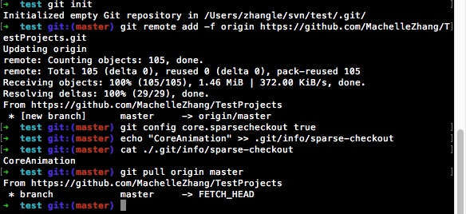

## 测试、学习工程

#### 目录

名称 | 描述
--- | ---
<font color="#00aaff">CoreAnimation</font> | 核心动画
<font color="#00aaff">TransitionAnimation</font> | 转场动画

#### 克隆单个项目

```ruby
// 创建本地文件夹
1 $mkdir project_folder
2 $cd project_folder
// 初始化git
3 $git init
// 添加远程仓库路径
4 $git remote add -f origin https://github.com/MachelleZhang/TestProjects.git
// 允许克隆单个文件、文件夹
5 $git config core.sparsecheckout true
// 添加需要克隆的文件、文件夹到配置文件中
6 $echo "examples/flaskr" >> .git/info/sparse-checkout
// 查看配置文件
7 $cat ./.git/info/sparse-checkout
// 拉取代码
8 $git pull origin master
```

##### e.g<br>

